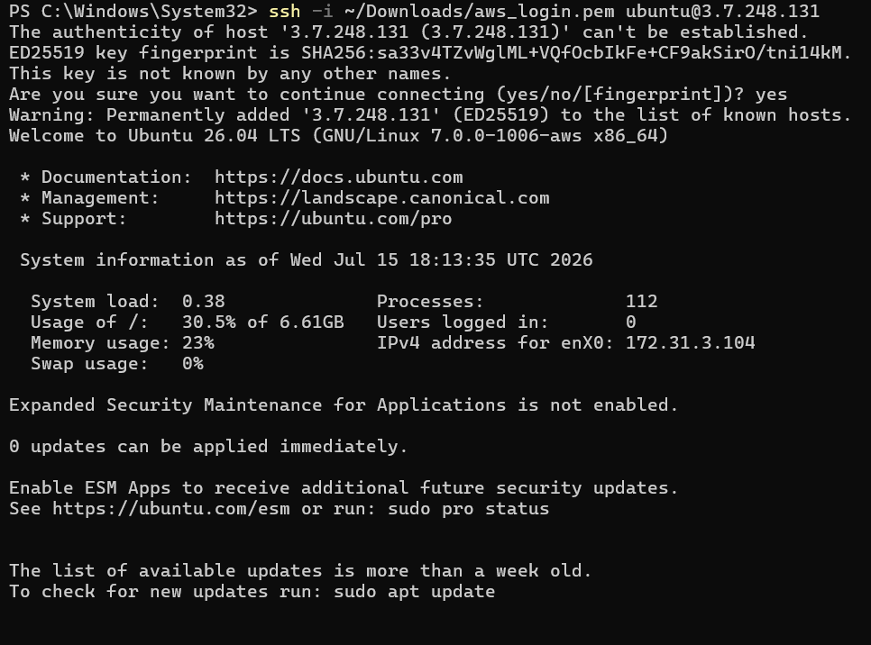
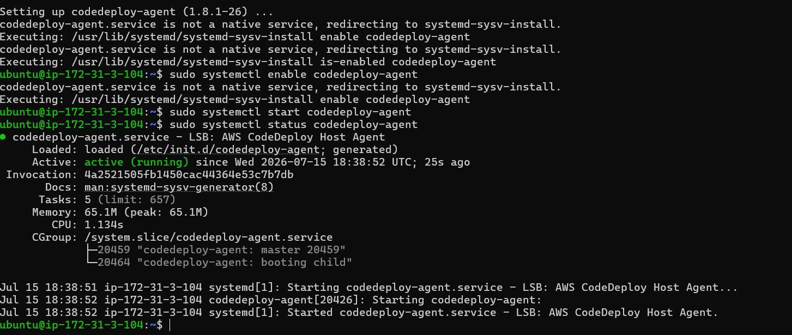
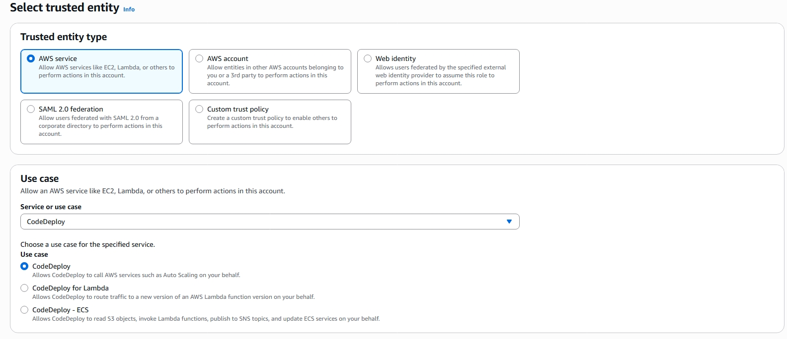
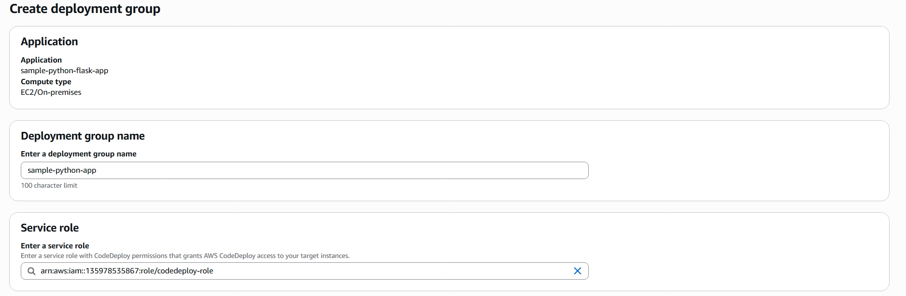
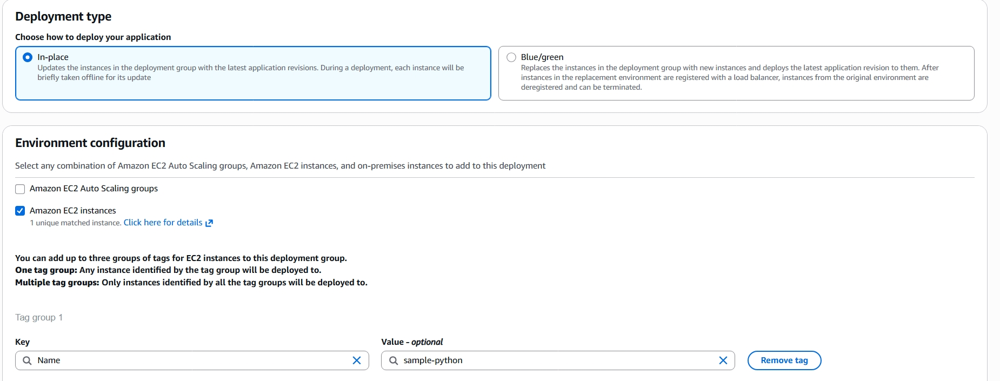
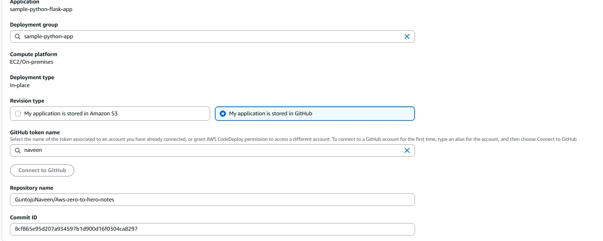
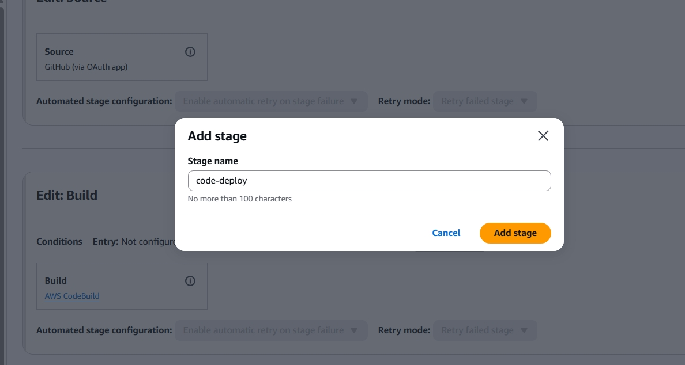
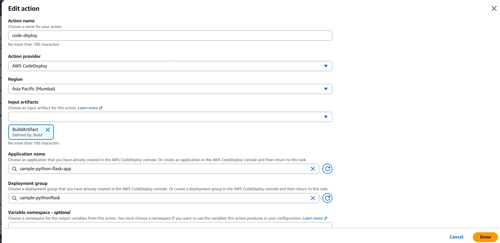
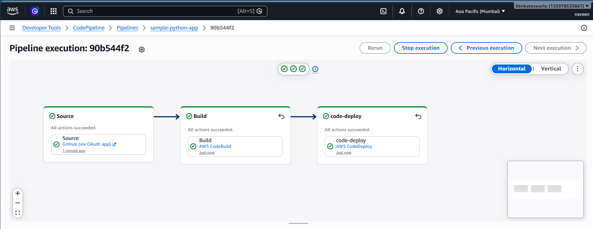

# AWS CodePipeline Demo
A sample Python Flask application with a complete CI/CD pipeline using AWS CodePipeline, CodeBuild, and CodeDeploy. This project demonstrates how to automate builds, manage secrets with Parameter Store, push Docker images to Docker Hub, and deploy seamlessly to AWS infrastructure.

This project demonstrates how to:
- Automate builds
- Manage secrets with AWS Parameter Store
- Push Docker images to Docker Hub
- Deploy seamlessly to AWS infrastructure
****
## 📋 Prerequisites
  Before you begin, ensure you have:
- An AWS account with access to CodePipeline, CodeBuild, CodeDeploy, IAM, and EC2.
- A GitHub account with a repository for your application.
- DockerHub account for storing container images.

## Installed tools:
- AWS CLI
- Git
- Docker
****
## Set Up GitHub Repository
The first step in our CI/CD journey is to set up a GitHub repository to store our Python application's source code. If you already have a repository, you can skip this step. Otherwise, create a new repository on GitHub by following these steps:

- Go to github.com and sign in to your account.
- Click on the "+" button in the top-right corner and select New repository.
- Provide a repository name and an optional description.
- Choose the appropriate visibility option (public or private).
- Initialize the repository with a README file.
- Click Create repository to finish.
- Great! Now that the repository is set up, we can move on to the next step.
*****
# Code build setup
- Create a CodeBuild project → Provide a name, select the default project, and add a description.
  
  

- Choose GitHub as the source and select Repository in my GitHub account. After entering details, it will ask for OAuth permission — confirm it.
   
  
  
  

- Select Single build and ensure Rebuild every time a code change is pushed to the repository is enabled.

  

- In the environment section, select On-demand, Managed image, and compute type as EC2. Choose Linux as the OS and create a new service role (or select an existing one).

  

  

- Provide a buildspec file. If you already have one in GitHub, select Use buildspec file.

  

- After creating the CodeBuild project, you’ll see the project details.
  
  
****
## Parameter Store Setup

- Go to AWS Systems Manager → Parameter Store, Save your Docker username, password, and registry URL as SecureString parameters.

  

  

- After creating parameters you will see like this

  

- Start a build to test. You may get an error because the service role doesn’t have SSM permissions.

  
****
## IAM Role Permissions

- Go to IAM → Roles → select the service role → attach AmazonSSMFullAccess.

  

  

- After attaching permissions, CodeBuild should succeed.

  

- Verify that the Docker image is updated in your DockerHub repository.

  
****
## CodePipeline Setup

- Create a custom pipeline.

   

- Enter a pipeline name, execution mode as Queued, and let AWS create the service role automatically.

   

- Select GitHub (OAuth App) as the source provider, then provide the repository name and branch.

   

   

- Choose CodeBuild as the build provider, select the project you created earlier, and configure input artifacts.
  
   

- Review all details and click Create pipeline.
  
   

   

- Test the pipeline by committing a change to GitHub. CodePipeline should automatically trigger CodeBuild.

   
  ****
  ## CodeDeploy Setup

- Create a CodeDeploy application → Provide a name and choose EC2/On-premises as the compute platform.

  

- Launch an EC2 instance, add a tag name, and enable a public IP.
  
  

- Connect to the EC2 instance using its PEM file and public IP.

  

- Install necessary packages and the CodeDeploy agent:
  ```bash
  sudo apt update
  sudo apt install ruby-full
  sudo apt install wget
  cd /home/ubuntu
  wget https://aws-codedeploy-ap-south-1.s3.ap-south-1.amazonaws.com/releases/codedeploy-agent_1.8.1-26_all.deb
  sudo dpkg -i --force-depends codedeploy-agent_1.8.1-26_all.deb
  chmod +x ./install
  sudo ./install auto
  sudo systemctl enable codedeploy-agent
  sudo systemctl start codedeploy-agent
  sudo systemctl status codedeploy-agent
  ```
  

- Create a service role for CodeDeploy.

  

- Create a deployment group → Provide a name, select the service role, choose In-place deployment, and target the EC2 instance using its tag.

  

  

- Create a deployment → Select the deployment group, choose GitHub as the revision type, and generate a GitHub personal access token.
  Go to GitHub → Settings → Developer settings → Personal access tokens → Tokens (classic).
- Click Generate new token.
- Give it a name (e.g., CodeDeployToken).
- Set an expiration (e.g., 90 days or longer if needed).
- Generate and copy the token — you’ll only see it once.
- Provide the repository name and commit ID to test deployment.

  

- Once successful, attach CodeDeploy to CodePipeline by adding a stage after CodeBuild.

  

- Configure the stage with action name, provider, region, input artifact, application name, and deployment group.
  
  

- Commit a change in GitHub and verify that the pipeline runs successfully end-to-end.

- Congratulations! You have successfully created and implemented an AWS CodePipeline project with CodeBuild and CodeDeploy.

  


  
  


  
  


  


 

  


  


  

  
  
  
  

  
